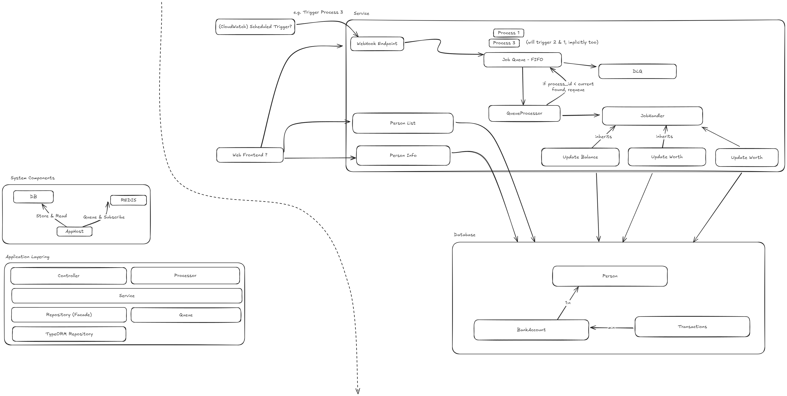

# Scalara Interview Code Challenge

A backend app that handles users' banking data and runs a few different calculations.

It does three main things: Updates the balance for each bank account, figures out how much each person is worth overall, and calculates the most they could borrow from their friends.

- [Preparation of your workspace](#preparation-of-your-workspace)
- [Clone and setup repository](#clone-and-setup-repository)
- [Repository structure](#repository-structure)
- [Tooling and Testing](#tooling-and-testing)
	- [Unit Tests](#unit-tests)
	- [Integration Tests](#integration-tests)
	- [Swagger UI](#swagger-ui)
- [CI/CD](#cicd)

- [⚠️⚠️ ToDos and Tech Debt](#️️-todos-and-tech-debt)
- [Notes](#️️notes)




### Preparation of your workspace

Required dependencies and tools are:

| Name                    | Description      | Source                                                        |
| ----------------------- | ---------------- | ------------------------------------------------------------- |
| Node.js                 | At least v22.5.1 | Node.js official Website, or: [asdf-vm](https://asdf-vm.com/) |
| Docker & Docker Compose | -                | -                                                             |

### Clone and setup repository

```sh
# Clone Repo
git clone git@github.com:Hobart2967/scalara-job

# Install required packages and set up project
yarn

# Boot required docker compose environment, including a database service.
cd infrastructure && docker compose up -d
```

### Useful links

| url                            | description                                |
| ------------------------------ | ------------------------------------------ |
| http://localhost:3000/         | Base Url of the service                    |
| http://localhost:3000/api      | Swagger documentation & Testing playground |
| http://localhost:3000/api-json | Swagger documentation as json              |
| http://localhost:3000/api-yaml | Swagger documentation as yaml              |
| http://localhost:4508/         | Redis Commander                            |

### Persons in Database Seed:

| id                                   | created             | updated             | name               | email                          |
| ------------------------------------ | ------------------- | ------------------- | ------------------ | ------------------------------ |
| 57e6614e-ef20-4b8b-96c4-183317682047 | 2025-04-14 00:54:36 | 2025-04-14 00:54:36 | Jason Walker       | Rubie.Schumm@yahoo.com         |
| 1581fb18-a3a3-4b8e-a8f8-4d92a61aa913 | 2025-04-14 00:54:36 | 2025-04-14 00:54:36 | Roland Thompson    | Aurore13@yahoo.com             |
| 1b7c00d6-9175-4ed6-a284-f964006527aa | 2025-04-14 00:54:36 | 2025-04-14 00:54:36 | Mr. Sidney Keebler | Katrina.Dietrich55@hotmail.com |

### Repository structure

| Path             | Description                                                                                                                               |
| ---------------- | ----------------------------------------------------------------------------------------------------------------------------------------- |
| ./compliance     | Contains Linting, Code Style etc. Configuration for all projects                                                                          |
| ./docs           | Contains docs & drawings about this domain/service                                                                                        |
| ./infrastructure | Contains well-needed infrastructural things for local development (e.g. third party services, databases)                                  |
| ./projects       | Contains all business logic, tests etc. It's a subdirectory because other parts for this business domain may follow (e.g. a web frontend) |

### Tooling and Testing

#### Test Docs

These files document the test results and the goal:

- [#1 Update Bank Account Balance](./docs/test/1.update-bank-accounts.md)
- [#2 Update Person Wealth](./docs/test/2.update-person-wealth.md)
- [#3 Update Loan Limits](./docs/test/3.update-loan-limit.md)

#### Manual Testing

Manual testing is currently possible by using the Swagger UI / OpenAPI Specification mentioned above. To do so, prepare as follows:

1. Start the infrastructure. It brings a pre-seeded database with 3 persons, some bank accounts and some transactions.
```sh
cd infrastructure && docker-compose up -d
```

2. Start the API project

```sh
cd projects/lend-stats-service && yarn start
```

3. Open http://localhost:3000/api
4. Feel free to test!

#### Unit Tests

This project uses unit tests. Run them using

```sh
cd projects/lend-stats-service
yarn test:cov
```

You will receive an inline coverage report as well. In addition, the project is fully integrated for running unit tests using Visual Studio Code.

#### Integration Tests

This project uses integration tests. It basically covers calling the APIs from outside using typical HTTP Requests. Run them using

```sh
cd projects/lend-stats-service
yarn test:e2e
```

##### Resetting integration test environment

Sometimes, it can be helpful to start the (integration test) environment from scratch. To do so, run:

```sh
(cd infrastructure; docker compose down --volumes)
(cd infrastructure; docker compose up -d)
```

##### Using VS Code

You can debug integration tests by jumping into a *.e2e-spec.ts file and hit F5. Set breakpoints etc as you wish and need.

#### Swagger UI

The API automatically exposes an OpenApi Specification. The endpoint listening would be http://localhost:3000.
There, you also have the possibility to test the API using a web frontend.

#### Redis GUI

Within the docker compose environment, there's also a pre-configured queue administration gui - the Redis commander. It runs at http://localhost:4508/

### CI/CD

This repository utilizes GitHub Actions as CI/CD Hoster. To run and test workflows locally, we recommand `act` - [see here](https://nektosact.com/introduction.html).

After installation of this tool (see its docs), you can run the workflow using

```sh
act push
```

from within the root folder of this repo.

## Common development Tasks

### Adding a new entity

1. Create a new file in the `projects/lend-stats-service/src/entities` folder
2. Add the entity to the `projects/lend-stats-service/src/app.module` file. Within there, you'll find the `databaseSourceFactory` call, which takes a list of entities to use with TypeORM.
3. As needed, create a entity-related repository.

## ⚠️⚠️ ToDos and Tech Debt

- Project uses faker-js for e2e tests. This is planned, but what was not planned, was to add it to the workspace root. Unfortunately, yarn did neither hoist nor localize the package into any of the node_modules directories from within the `./projects/lend-stats-service` folder and upwards. It was simply not there, while yarn telling `Hey! It's installed`.
I quit the research about that problem for time reasons and added it to this list.
- Some ToDos in the Code have been marked with "TODO". Those are steps that I would plan for the future if continuing to develop on this project.
- Cascading and database layout needs to be improved. E.g. when a friendship is cancelled, there's currently no logic that also cleans up the friends loan limits.
- Jest detected an open handle and does not exist when not using `--forceExit` - This needs to be investigated if this is critical and where it is coming from. Potential memory leak!

## Notes

- Since I have never worked with Graph Databases, I chose Maria DB / MySQL for simplicity and implementation speed reasons. This does not mean I'd go for that in a business use case, because it may be worth looking at other solutions as well, as they may suit better.
- One thing that can be improved for sure is the handling of queues and messages with Redis - My queues knowledge is limited to MSMQ and SQS, so I would see potential in improving here.
- Testing strategy: I decided to go for mocking instead of booting up the whole container for Unit Tests. This gains build speed and does not loose anything, as I still to integration testing - keeping the whole wiring tested.
- TypeORM is my all-time bucket-list entry - So I haven't used it yet, so I see way more potential in leveraging its benefits, such as proper usage of the entity reltion properties, which I rarely used in this project. I focused on setting up the database model with it, be able to do queries, but as for time reasons I did not dig deeper, which I would've done in a real situation.

## Outlook

Things that at minimum are still open:

- Technical, as well as business documentation is missing. It would help looking at this service in 3 years to get into details when trying to fix or extend this service.
- Tests are technically not yet covering a satisfying amount of code and use cases. Especially when thinking about "rainy day" cases, there can be more tests. I focused on the main aspects for time reasons. I a real situation I would go for testing even more than I did over here.
- When I would plan to continue the project, I would also ensure to have security implemented. This API is implemented completely publicly visible which is bad for the data we deal with. That includes
  - Token / Authorization verification
  - DDoS Protection, etc.
  - Application Firewall & Intrusion detection.
- Deployment to a stage is not yet implemented and still needs to be done.
- Monitoring and Technical Support fragments is missing - e.g. for observing queues, dlq's and exceptions.
- There is no customer facing application at this time. This project has been implemented solely as backend project, providing APIs.
- Performance optimizations
  - Currently, the job gets all bank accounts and processes them one after the other. What could be done instead, is creating a queue entry for each bank account, processing the accounts in parallel.
  - Database optimizations can be made. I already hinted some indices in the entities, but there could be more optimizations that can be done.
- Currency Management - Currencies are not covered, this may or may not be the case
- Ground Zero - The service expects bank accounts to be there and pre-filled with data. It does not cover creating bank acccounts, transactions, etc. This is not prone to errors and needs to be covered.
- Data Protection topics etc need to be discussed. Who may access which data, etc?
- Does this project have the need to analyze historical data?